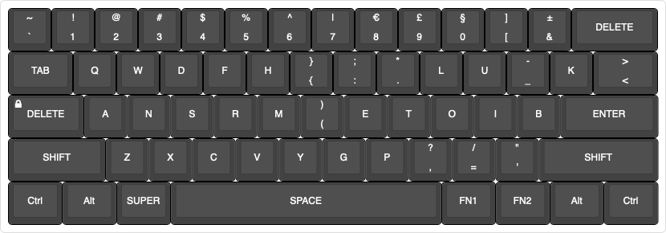
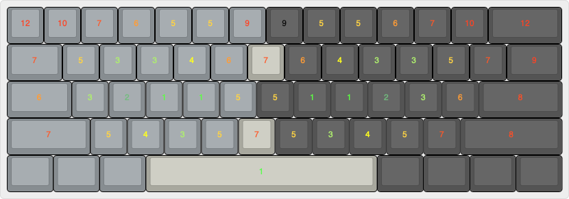
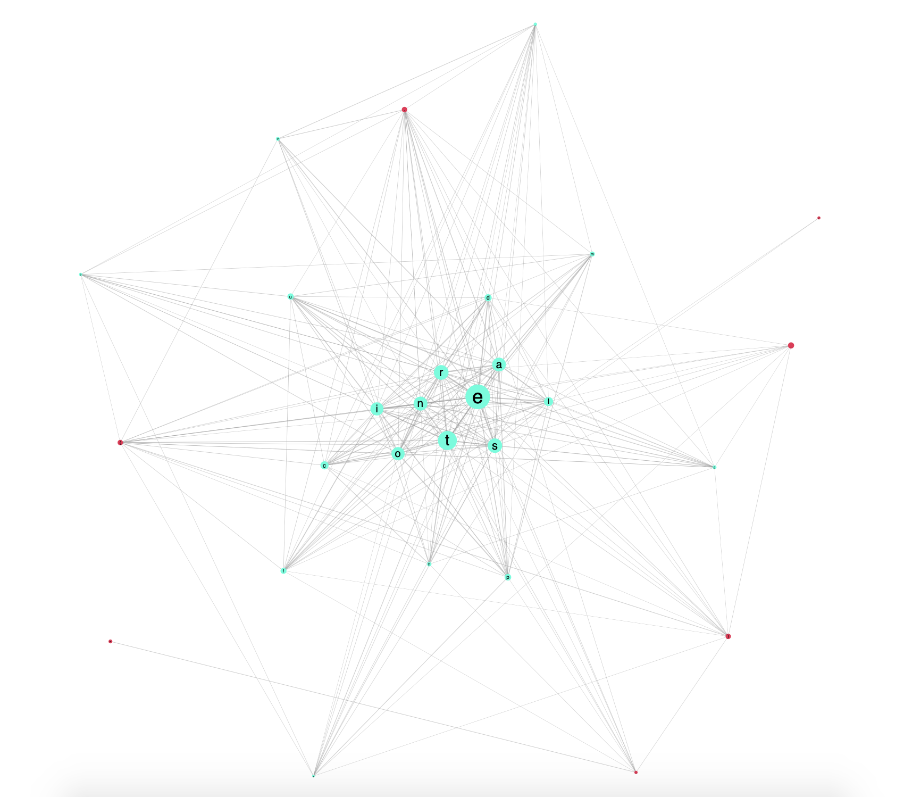

A modern keyboard layout for developers

- [TL;DR](#tldr)
- [Why](#why)
- [Keyboard strain](#keyboard-strain)
- [Bounds](#bounds)
  - [Key distribution](#key-distribution)
    - [Reducing strain](#reducing-strain)
    - [Alternating hands and fingers](#alternating-hands-and-fingers)
    - [WQAZXCV](#wqazxcv)
  - [Brackets ([{<>}])](#brackets)
  - [About <kbd>CAPSLOCK</kbd> 🤬](#about-kbdcapslockkbd-%F0%9F%A4%AC)
  - [No physical changes](#no-physical-changes)
- [Data analysis](#data-analysis)
  - [Concepts](#concepts)
  - [Complete list of repo used](#complete-list-of-repo-used)
  - [Results](#results)
    - [Most used characters and their bigrams](#most-used-characters-and-their-bigrams)
    - [Character map](#character-map)
- [Sources](#sources)

## TL;DR

turbobanst is an attempt to build a better keyboard layout, dedicated in typing modern code.

## Why

turbobanst is a [keyboard layout](https://en.wikipedia.org/wiki/Keyboard_layout) which try to achieve a better key placement for software development. This layout is based on a keyboard strain layout built around the home row (c.f. [touch typing](https://en.wikipedia.org/wiki/Touch_typing)) cross-referenced with the most used characters and bigrams in modern source code languages. Currently the layout is in early stage, with only a macOS native layout. Roadmap inlclude a release of native - no remapping software should be used - Linux (most used distrib) and Windows layout, a template to print custom keycap and ramp-up learning results. 



## Keyboard strain

A keyboard strain layout has been created to help visualizing where keys will be best placed. This layout is a pure subjective vision on how I feel it's *easy* or *hard* to reach a key. It would be better to have a keyboard strain layout based on physiologicals (more globally scientifics) facts / studies. Currently I didn't find such a study, all I could find was *how-it-feel* based layouts. If someone has the knowledge to help with a more scientific approach, this could help to actually extends this project to an automatic layout builder (machine learning based).



> Sources of this layout can be find in [keyboard-strain-layout.json](resources/keyboard-strain-layout.json) and edited with the help of this [online keyboard layout editor](http://www.keyboard-layout-editor.com/##@_backcolor=%23ffffff&name=Keyboard%20strain&author=Banst%3B&@_c=%23878d91&t=%23ff0000&a:7%3B&=12&=10&_t=%23ff2f00%3B&=7&_t=%23ff7700%3B&=6&_t=%23ffa800%3B&=5&=5&_t=%23ff0000%3B&=9&_c=%23545454&t=%23000000%3B&=9&_t=%23ffa800%3B&=5&=5&_t=%23ff7700%3B&=6&_t=%23ff2f00%3B&=7&_t=%23ff0000%3B&=10&_w:2%3B&=12%3B&@_c=%23878d91&t=%23ff2f00&w:1.5%3B&=7&_t=%23ffa800%3B&=5&_t=%2383c445%3B&=3&=3&_t=%23f9ff00%3B&=4&_t=%23ff7700%3B&=6&_c=%23a8a89e&t=%23ff2f00%3B&=7&_c=%23545454&t=%23ff7700%3B&=6&_t=%23f9ff00%3B&=4&_t=%2383c445%3B&=3&=3&_t=%23ffa800%3B&=5&_t=%23ff2f00%3B&=7&_t=%23ff0000&w:1.5%3B&=9%3B&@_c=%23878d91&t=%23ff7700&w:1.75%3B&=6&_t=%2383c445%3B&=3&_t=%23519c5f%3B&=2&_t=%2313ff00%3B&=1&=1&_t=%23ffa800%3B&=5&_c=%23545454%3B&=5&_t=%2313ff00%3B&=1&=1&_t=%23519c5f%3B&=2&_t=%2383c445%3B&=3&_t=%23ff7700%3B&=6&_t=%23ff1f00&w:2.25%3B&=8%3B&@_c=%23878d91&t=%23ff2f00&w:2.25%3B&=7&_t=%23ffa800%3B&=5&_t=%23f9ff00%3B&=4&_t=%2383c445%3B&=3&_t=%23ffa800%3B&=5&_c=%23a8a89e&t=%23ff2f00%3B&=7&_c=%23545454&t=%23ffa800%3B&=5&_t=%2383c445%3B&=3&_t=%23f9ff00%3B&=4&_t=%23ffa800%3B&=5&_t=%23ff2f00%3B&=7&_t=%23ff1f00&w:2.75%3B&=8%3B&@_c=%23878d91&t=%23000000&w:1.25%3B&=&_w:1.25%3B&=&_w:1.25%3B&=&_c=%23a8a89e&t=%2300ff1b&w:6.25%3B&=1&_c=%23545454&t=%23000000&w:1.25%3B&=&_w:1.25%3B&=&_w:1.25%3B&=&_w:1.25%3B&=)

## Bounds

### Key distribution

#### Reducing strain

The main goal of this keyboard is to reduce finger / wirst strain and movement during day-to-day typing. Most used characters will be counted from code source files, extracted from popular Github repos (using modern languages). 

#### Alternating hands and fingers

Best effort will be made to avoid double tap on a single hand / finger. To achieve this, most used bigrams will be extracted during data analysis phase, and keys will be distributed in a heterogeneous way.

#### WQAZXCV

Best effort will be made to keep the <kbd>WQ</kbd><kbd>A</kbd><kbd>Z</kbd><kbd>X</kbd><kbd>C</kbd><kbd>V</kbd> keys confortable and convenient when used in conjunction with the <kbd>Cmd</kbd> / <kbd>Ctrl</kbd> key, in order to keep the most used shortcuts simple.

### Brackets ([{<>}])

On classic keyboard layouts (like qwerty) opening brackets and their matching closing brackets are often on 2 adjacents keys. But nowadays, any proper IDE will automatically close the bracket for you as soon as you open it. To be more friendly with that concept, opening bracket and its soulmate will be on the same key. One on the normal layout (open), the other on the <kbd>SHIFT</kbd> layer.

### About <kbd>CAPSLOCK</kbd> 🤬

Choice has been made to remove (or at least send it to an *fn layout*) the caps lock key. Why is that ? Because average usage of the caps lock key for chill people is very low. It would be more convenient, as first implemented in [Colemak layout](https://colemak.com) to replace the caps lock key by a second - left handed - backspace.

### No physical changes

Although the ergonomics of a classic computer keyboard is questionable, the goal here is not to reinvent a physical keyboard. The base of the layout will be a 60% ansi (61 keys) keyboard, to be compatible with most of the keyboards currently on the market.

## Data analysis

### Concepts

In order to help with key placement, a bunch of modern source code taken from few of the most popular Github repos has been parsed. 

The metrics extracted are :

- Count of apparition for each character (including blank ones)
- Count of bigrams (adjacent character)

### Complete list of repo used

| Language   | Repo                                                                          | Data size |
| ---------- | ----------------------------------------------------------------------------- | --------- |
| go         | [go](https://github.com/golang/go)                                            | 1.1M      |
| javascript | [node](https://github.com/nodejs/node)                                        | 1.1M      |
| python     | [algorithms](https://github.com/keon/algorithms)                              | 820k      |
| rust       | [xi-editor](https://github.com/xi-editor/xi-editor/tree/master/rust/rope/src) | 1.1M      |
| scala      | [scala](https://github.com/scala/scala)                                       | 1008K     |
| typescript | [angular](https://github.com/angular/angular)                                 | 668K      |

### Results

#### Most used characters and their bigrams

The most used character (blank excluded) is *e*, representing 9.2% of total typing. If we correlate the following json extract with the strain layout, we can put the 8 first keys on the home layout, representing 47.6% of total typing. We can add 6 more keys on the light strain (=3) positions reaching a total of 64% of total typing.

<details><summary>data.json</summary>
<p>

```json
{
  "nodes": [
    { "id": "e", "group": 0, "percentage": 9.256777852152501 },
    { "id": "t", "group": 0, "percentage": 7.140935104882532 },
    { "id": "r", "group": 0, "percentage": 5.511389658620024 },
    { "id": "s", "group": 0, "percentage": 5.4301477600317805 },
    { "id": "n", "group": 0, "percentage": 5.222289982858719 },
    { "id": "a", "group": 0, "percentage": 5.16088021876697 },
    { "id": "o", "group": 0, "percentage": 4.956272117537438 },
    { "id": "i", "group": 0, "percentage": 4.922864234005824 },
    { "id": "l", "group": 0, "percentage": 3.4022588588595886 },
    { "id": "c", "group": 0, "percentage": 3.067937057117762 },
    { "id": "d", "group": 0, "percentage": 2.683199722046409 },
    { "id": "p", "group": 0, "percentage": 2.490861425313943 },
    { "id": "u", "group": 0, "percentage": 2.363486276648861 },
    { "id": ",", "group": 1, "percentage": 2.3092743929180144 },
    { "id": "f", "group": 0, "percentage": 2.2506891135248477 },
    { "id": ".", "group": 1, "percentage": 2.041889841452259 },
    { "id": ")", "group": 1, "percentage": 2.014647230972388 },
    { "id": "(", "group": 1, "percentage": 2.01312869081186 },
    { "id": "m", "group": 0, "percentage": 1.8604850338755938 },
    { "id": "h", "group": 0, "percentage": 1.6483146026466333 },
    { "id": "v", "group": 0, "percentage": 1.4605926680021721 },
    { "id": "g", "group": 0, "percentage": 1.459225981857697 },
    { "id": "=", "group": 1, "percentage": 1.4321048545906683 },
    { "id": "_", "group": 0, "percentage": 1.2623624354468577 },
    { "id": ":", "group": 1, "percentage": 1.2106105867760664 },
    { "id": "b", "group": 0, "percentage": 1.2084846305513273 },
    { "id": "/", "group": 1, "percentage": 1.1458296635279455 },
    { "id": "y", "group": 0, "percentage": 1.0093129030964856 }
  ],
  "links": [
    { "source": "e", "target": "r", "value": 1 },
    { "source": "e", "target": "s", "value": 0.6907369226780578 },
    { "source": "e", "target": "t", "value": 0.6274892282620773 },
    { "source": "i", "target": "n", "value": 0.6033901653106829 },
    { "source": "n", "target": "o", "value": 0.546833911529772 },
    { "source": "e", "target": "n", "value": 0.5303398807392684 },
    { "source": "s", "target": "t", "value": 0.5025617600217287 },
    { "source": "e", "target": "l", "value": 0.4888578871344091 },
    { "source": "o", "target": "r", "value": 0.48221582982505956 },
    { "source": "a", "target": "r", "value": 0.45086976382424476 },
    { "source": "d", "target": "e", "value": 0.44943764737836267 },
    { "source": "a", "target": "t", "value": 0.44864751416684157 },
    { "source": "i", "target": "t", "value": 0.4355115495253028 },
    { "source": "a", "target": "l", "value": 0.4103013617452067 },
    { "source": "c", "target": "o", "value": 0.3814614995246855 },
    { "source": "h", "target": "t", "value": 0.37210335930073213 },
    { "source": "r", "target": "t", "value": 0.312584105976617 },
    { "source": "n", "target": "t", "value": 0.3109668020592847 },
    { "source": "i", "target": "s", "value": 0.3101149396906135 },
    { "source": "o", "target": "p", "value": 0.3016703909924814 },
    { "source": "a", "target": "n", "value": 0.2869047766021803 },
    { "source": "f", "target": "i", "value": 0.2832997938246151 },
    { "source": "e", "target": "m", "value": 0.2786454153754985 },
    { "source": "o", "target": "t", "value": 0.2703366708230966 },
    { "source": "c", "target": "e", "value": 0.26752182125705254 },
    { "source": "n", "target": "s", "value": 0.26071926813911284 },
    { "source": "i", "target": "l", "value": 0.2525339819010111 },
    { "source": "a", "target": "c", "value": 0.2217434783145471 },
    { "source": "e", "target": "p", "value": 0.22163236583167695 },
    { "source": "a", "target": "s", "value": 0.21744712897690094 },
    { "source": "a", "target": "m", "value": 0.21303966715638464 },
    { "source": "c", "target": "t", "value": 0.21255817973061397 },
    { "source": "i", "target": "r", "value": 0.21085445499327152 },
    { "source": "d", "target": "n", "value": 0.20592846825269448 },
    { "source": "/", "target": "/", "value": 0.202113606340819 },
    { "source": "g", "target": "n", "value": 0.20024938579488635 },
    { "source": "d", "target": "i", "value": 0.19869381103470413 },
    { "source": "r", "target": "u", "value": 0.19629871973728072 },
    { "source": "e", "target": "h", "value": 0.19607649477154038 },
    { "source": "f", "target": "o", "value": 0.19269373695971556 },
    { "source": "l", "target": "u", "value": 0.18821220015061915 },
    { "source": "i", "target": "o", "value": 0.18558253805602537 },
    { "source": "a", "target": "p", "value": 0.18316275509574192 },
    { "source": "t", "target": "u", "value": 0.18243435104137087 },
    { "source": "n", "target": "u", "value": 0.17427375646612922 },
    { "source": ".", "target": "a", "value": 0.1721749651230262 },
    { "source": "a", "target": "d", "value": 0.16906381560266176 },
    { "source": "e", "target": "v", "value": 0.1685946740083211 },
    { "source": "l", "target": "o", "value": 0.16626131186804777 },
    { "source": "a", "target": "v", "value": 0.16054519191594957 },
    { "source": "m", "target": "o", "value": 0.15977975036728848 },
    { "source": "a", "target": "e", "value": 0.1590760379757775 },
    { "source": "d", "target": "o", "value": 0.15552043852393238 },
    { "source": "e", "target": "g", "value": 0.15148335164631663 },
    { "source": ".", "target": "s", "value": 0.148940110371733 },
    { "source": "g", "target": "r", "value": 0.1481870146545019 },
    { "source": "(", "target": "t", "value": 0.14747095643156088 },
    { "source": "s", "target": "u", "value": 0.14358201953110533 },
    { "source": "e", "target": "f", "value": 0.1416066865023025 },
    { "source": "o", "target": "s", "value": 0.1380387412190274 },
    { "source": "s", "target": "s", "value": 0.13586587488734428 },
    { "source": "t", "target": "y", "value": 0.13452017926147236 },
    { "source": "(", "target": "e", "value": 0.12387807256879714 },
    { "source": "e", "target": "u", "value": 0.11756935270805813 },
    { "source": "c", "target": "h", "value": 0.11714959443943752 },
    { "source": "p", "target": "t", "value": 0.11672983617081692 },
    { "source": "(", "target": ")", "value": 0.11437178236768356 },
    { "source": "r", "target": "r", "value": 0.11319892838183188 },
    { "source": ".", "target": "v", "value": 0.11268040346177113 },
    { "source": "p", "target": "r", "value": 0.1123841035074507 },
    { "source": "c", "target": "i", "value": 0.10919887899850615 },
    { "source": ".", "target": "t", "value": 0.10854454993271521 },
    { "source": "c", "target": "n", "value": 0.10460622970653959 },
    { "source": "i", "target": "m", "value": 0.10424820059506908 },
    { "source": "_", "target": "v", "value": 0.10386547982073853 },
    { "source": "a", "target": "h", "value": 0.10347041321497796 },
    { "source": "p", "target": "y", "value": 0.10337164656353783 },
    { "source": "n", "target": "r", "value": 0.10203829676909591 },
    { "source": "h", "target": "i", "value": 0.10172965098334548 },
    { "source": "m", "target": "p", "value": 0.09989012210027284 },
    { "source": "g", "target": "i", "value": 0.09951974715737232 },
    { "source": "g", "target": "s", "value": 0.09859380980012099 },
    { "source": ".", "target": "e", "value": 0.0976925641057297 },
    { "source": ")", "target": ")", "value": 0.09674193508561835 },
    { "source": ":", "target": "=", "value": 0.09608760601982741 },
    { "source": "l", "target": "p", "value": 0.0934209064309436 },
    { "source": "r", "target": "s", "value": 0.093001148162323 },
    { "source": "b", "target": "o", "value": 0.09043321522487932 },
    { "source": "a", "target": "b", "value": 0.08771713231027543 },
    { "source": "b", "target": "u", "value": 0.086717119964444 },
    { "source": "i", "target": "v", "value": 0.08637143668440352 },
    { "source": "l", "target": "l", "value": 0.08548253682144225 },
    { "source": "(", "target": "s", "value": 0.08497635773281152 },
    { "source": "b", "target": "e", "value": 0.08460598278991098 },
    { "source": "f", "target": "l", "value": 0.08282818306398844 },
    { "source": "l", "target": "s", "value": 0.08212447067247744 },
    { "source": "o", "target": "u", "value": 0.08177878739243695 },
    { "source": "m", "target": "u", "value": 0.07924789194928332 },
    { "source": "e", "target": "i", "value": 0.07823553377202187 },
    { "source": "c", "target": "l", "value": 0.07813676712058173 },
    { "source": "_", "target": "e", "value": 0.07633427573179916 },
    { "source": "(", "target": "c", "value": 0.07593920912603859 },
    { "source": "p", "target": "s", "value": 0.07493919678020716 },
    { "source": ".", "target": "r", "value": 0.0744083260287164 },
    { "source": "a", "target": "u", "value": 0.07371695946863542 },
    { "source": "s", "target": "y", "value": 0.07363053864862529 },
    { "source": "a", "target": "i", "value": 0.07318608871714466 },
    { "source": "_", "target": "t", "value": 0.07313670539142458 },
    { "source": "l", "target": "t", "value": 0.07238360967419351 },
    { "source": "=", "target": "=", "value": 0.06932184347954913 },
    { "source": "b", "target": "l", "value": 0.06770453956221682 },
    { "source": "f", "target": "u", "value": 0.06743293127075643 },
    { "source": "(", "target": "r", "value": 0.06574155236484401 },
    { "source": "p", "target": "u", "value": 0.06409955678465167 },
    { "source": "d", "target": "d", "value": 0.06351930270744083 },
    { "source": "(", "target": "n", "value": 0.06192669045296856 },
    { "source": "c", "target": "r", "value": 0.06158100717292806 },
    { "source": ")", "target": "e", "value": 0.06124766972431758 },
    { "source": "_", "target": "s", "value": 0.05959332831269522 },
    { "source": "a", "target": "f", "value": 0.05950690749268509 },
    { "source": "d", "target": "l", "value": 0.05925999086408474 },
    { "source": ".", "target": "o", "value": 0.059037765898344426 },
    { "source": "b", "target": "r", "value": 0.058827886764034124 },
    { "source": ".", "target": "p", "value": 0.058173557698243186 },
    { "source": "a", "target": "g", "value": 0.05816121186681317 },
    { "source": "h", "target": "s", "value": 0.05705008703811158 },
    { "source": "f", "target": "f", "value": 0.056716749589501105 },
    { "source": ".", "target": "f", "value": 0.05624760799516043 },
    { "source": "h", "target": "o", "value": 0.054605612414968085 },
    { "source": ":", "target": ":", "value": 0.05348214175483648 },
    { "source": ".", "target": "c", "value": 0.052877196014765614 },
    { "source": "o", "target": "o", "value": 0.05264262521759528 },
    { "source": "c", "target": "s", "value": 0.05151915455746367 },
    { "source": ",", "target": "e", "value": 0.05145742540031358 },
    { "source": "_", "target": "r", "value": 0.05085247966024272 },
    { "source": ".", "target": "n", "value": 0.05032160890875196 },
    { "source": "c", "target": "u", "value": 0.050136421437301695 },
    { "source": "f", "target": "n", "value": 0.05005000061729157 },
    { "source": "f", "target": "r", "value": 0.049593204854380915 },
    { "source": "c", "target": "p", "value": 0.04849442585710935 },
    { "source": "e", "target": "e", "value": 0.04828454672279905 },
    { "source": "d", "target": "r", "value": 0.048049975925628714 },
    { "source": "(", "target": "g", "value": 0.04796355510561859 },
    { "source": "(", "target": "o", "value": 0.046852430276917 },
    { "source": "t", "target": "t", "value": 0.04679070111976691 },
    { "source": ")", "target": "t", "value": 0.046296867862566204 },
    { "source": "i", "target": "p", "value": 0.04506228471956444 },
    { "source": "(", "target": "d", "value": 0.04484005975382412 },
    { "source": ".", "target": "d", "value": 0.04459314312522377 },
    { "source": ":", "target": "t", "value": 0.044543759799503695 },
    { "source": "a", "target": "y", "value": 0.044407955653773507 },
    { "source": ":", "target": "e", "value": 0.044173384856603166 },
    { "source": "b", "target": "m", "value": 0.044136347362313116 },
    { "source": ",", "target": "s", "value": 0.04403758071087297 },
    { "source": "(", "target": "p", "value": 0.04348201829652218 },
    { "source": "(", "target": "v", "value": 0.04171656440202966 },
    { "source": ".", "target": "l", "value": 0.041259768639119 },
    { "source": "g", "target": "u", "value": 0.04075358955048828 },
    { "source": "m", "target": "y", "value": 0.04011160631612736 },
    { "source": ")", "target": ".", "value": 0.03982765219323695 },
    { "source": ",", "target": "t", "value": 0.03981530636180693 },
    { "source": ".", "target": "i", "value": 0.03969184804750676 },
    { "source": "l", "target": "y", "value": 0.03938320226175632 },
    { "source": "o", "target": "v", "value": 0.039123939801725946 },
    { "source": "(", "target": "f", "value": 0.038556031555945135 },
    { "source": ")", "target": ",", "value": 0.038247385770194695 },
    { "source": "_", "target": "o", "value": 0.03817331078161459 },
    { "source": "(", "target": "i", "value": 0.03816096495018457 },
    { "source": "r", "target": "y", "value": 0.03816096495018457 },
    { "source": "i", "target": "u", "value": 0.037926394153014235 },
    { "source": "_", "target": "c", "value": 0.0379017024901542 },
    { "source": "n", "target": "y", "value": 0.03514858208126026 },
    { "source": "f", "target": "t", "value": 0.03485228212693984 },
    { "source": ":", "target": "s", "value": 0.03477820713835973 },
    { "source": "_", "target": "i", "value": 0.03385226978110841 },
    { "source": "d", "target": "s", "value": 0.033753503129668266 },
    { "source": "e", "target": "o", "value": 0.033469549006777864 },
    { "source": "d", "target": "u", "value": 0.033457203175347845 },
    { "source": "e", "target": "y", "value": 0.03338312818676774 },
    { "source": "f", "target": "s", "value": 0.03250657415523649 },
    { "source": ":", "target": "d", "value": 0.032333732515216235 },
    { "source": "(", "target": "l", "value": 0.03232138668378622 },
    { "source": "_", "target": "d", "value": 0.03212385338090594 },
    { "source": "b", "target": "i", "value": 0.03154359930369511 },
    { "source": ".", "target": "g", "value": 0.03132137433795479 },
    { "source": ".", "target": "m", "value": 0.03130902850652477 },
    { "source": ".", "target": "b", "value": 0.03116087852936456 },
    { "source": ")", "target": "s", "value": 0.03111149520364449 },
    { "source": ")", "target": ":", "value": 0.030099137026383043 },
    { "source": "m", "target": "r", "value": 0.030086791194953024 },
    { "source": "g", "target": "o", "value": 0.029704070420622477 },
    { "source": "(", "target": "m", "value": 0.0295806121063223 },
    { "source": ")", "target": "d", "value": 0.02946949962345214 },
    { "source": "m", "target": "s", "value": 0.02906208718626156 },
    { "source": ")", "target": "r", "value": 0.028827516389091222 },
    { "source": "g", "target": "h", "value": 0.02725959579747898 },
    { "source": "b", "target": "y", "value": 0.025975629328757147 },
    { "source": "_", "target": "m", "value": 0.025518833565846492 },
    { "source": ":", "target": "n", "value": 0.025345991925826244 },
    { "source": "(", "target": "a", "value": 0.025284262768676156 },
    { "source": "n", "target": "n", "value": 0.025247225274386102 },
    { "source": "_", "target": "n", "value": 0.025062037802935838 },
    { "source": "_", "target": "l", "value": 0.02411140878282448 },
    { "source": "(", "target": "h", "value": 0.022975592291262854 },
    { "source": "p", "target": "p", "value": 0.02295090062840282 },
    { "source": ",", "target": "d", "value": 0.022666946505512413 },
    { "source": "_", "target": "p", "value": 0.022259534068321832 },
    { "source": "(", "target": "y", "value": 0.02206200076544155 },
    { "source": "d", "target": "t", "value": 0.02183977579970123 },
    { "source": ":", "target": "h", "value": 0.020987913431030014 },
    { "source": "r", "target": "v", "value": 0.02038296769095915 },
    { "source": "m", "target": "t", "value": 0.020296546870949023 },
    { "source": "g", "target": "t", "value": 0.019679255299448143 },
    { "source": ":", "target": "r", "value": 0.019444684502277806 },
    { "source": "b", "target": "s", "value": 0.018938505413647083 },
    { "source": ",", "target": "r", "value": 0.018827392930776923 },
    { "source": "_", "target": "f", "value": 0.018494055482166448 },
    { "source": "h", "target": "r", "value": 0.018444672156446375 },
    { "source": "l", "target": "n", "value": 0.018382942999296287 },
    { "source": "l", "target": "r", "value": 0.017728613933505354 },
    { "source": ".", "target": "h", "value": 0.017568118124915124 },
    { "source": ")", "target": "l", "value": 0.017284164002024715 },
    { "source": ")", "target": "y", "value": 0.016987864047704294 },
    { "source": "b", "target": "t", "value": 0.01683971407054408 },
    { "source": "_", "target": "g", "value": 0.016802676576254026 },
    { "source": "n", "target": "v", "value": 0.016765639081963976 },
    { "source": "_", "target": "h", "value": 0.01658045161051371 },
    { "source": ".", "target": "u", "value": 0.016506376621933605 },
    { "source": "m", "target": "m", "value": 0.01648168495907357 },
    { "source": ".", "target": "_", "value": 0.016395264139063444 },
    { "source": "(", "target": "b", "value": 0.015852047556142668 },
    { "source": "a", "target": "o", "value": 0.015765626736132545 },
    { "source": ")", "target": "n", "value": 0.015197718490351732 },
    { "source": "_", "target": "b", "value": 0.014802651884591168 },
    { "source": ")", "target": "g", "value": 0.013703872887319597 },
    { "source": "n", "target": "p", "value": 0.01332115211298905 },
    { "source": ",", "target": "f", "value": 0.013210039630118891 },
    { "source": ",", "target": "n", "value": 0.012913739675798466 },
    { "source": "c", "target": "d", "value": 0.012753243867208237 },
    { "source": ".", "target": ".", "value": 0.012716206372918185 },
    { "source": ":", "target": "f", "value": 0.012247064778577513 },
    { "source": "d", "target": "f", "value": 0.012148298127137372 },
    { "source": "a", "target": "a", "value": 0.012037185644267213 },
    { "source": "d", "target": "p", "value": 0.012037185644267213 },
    { "source": "o", "target": "y", "value": 0.011950764824257089 },
    { "source": ",", "target": "l", "value": 0.01179026901566686 },
    { "source": "_", "target": "a", "value": 0.011728539858516771 },
    { "source": "/", "target": "s", "value": 0.01158038988135656 },
    { "source": ":", "target": "p", "value": 0.011419894072766331 },
    { "source": ",", "target": "y", "value": 0.01132112742132619 },
    { "source": "/", "target": "l", "value": 0.011135939949875924 },
    { "source": ",", "target": "g", "value": 0.011037173298435784 },
    { "source": "g", "target": "l", "value": 0.010851985826985518 },
    { "source": ")", "target": "c", "value": 0.010827294164125483 },
    { "source": "c", "target": "c", "value": 0.010333460906924778 },
    { "source": ")", "target": "f", "value": 0.010296423412634724 }
  ]
}
```

</p>
</details>

#### Character map

The following screenshot is a [force direct graph](https://observablehq.com/@d3/force-directed-graph) of the previous result extract. A dynamic version is available by running a simple http server (`python -m SimpleHTTPServer` is fine) in *data-analysis/build* after runing `yarn run run` to extract and prepare data.



This graph show the most used characters (radius of circle is proportional to character appearance) and links (bigrams) between them. The dynamic version is usefull to distribute character across left and right hand (when you drag a character, the ones following it close are the ones that should be on a different hand).

## Sources

- [Colemak](https://colemak.com)
- [Dvorak](https://www.dvorak-keyboard.com)
- [History of QWERTY](https://en.wikipedia.org/wiki/QWERTY#History)
- [Workman layout](https://workmanlayout.org)
- [Topic about keyboard strain](https://geekhack.org/index.php?topic=82183.0)
- [Online keyboard layout editor](http://www.keyboard-layout-editor.com)